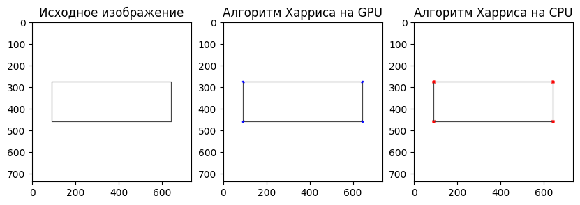
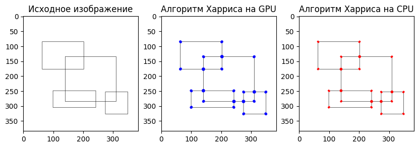
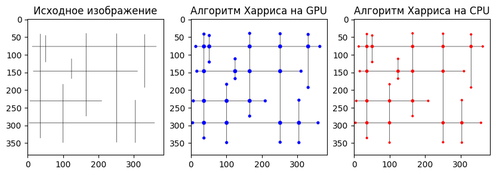

# **Лабораторная работа 4: Алгоритм Харриса**

*Задача:* реализовать алгоритм Харриса для поиска углов на изображении на языке Python.

*Входные данные:* изображение в формате BMP.

*Выходные данные:* 

- время выполнения обработки изображения на CPU;

- время выполнения обработки изображения на GPU;

- результирующее изображение после применения алгоритма Харриса на CPU;

- результирующее изображение после применения алгоритма Харриса на GPU.

Реализация должна содержать 2 функции алгоритма Харриса: на CPU и на GPU с применением CUDA.

## **Описание работы:**

- Google Colab использует видеокарту Nvidia Tesla T4.

- Функция *harris_corners_cpu* реализует алгоритм обнаружения угловых точек на изображении с использованием метода Харриса на CPU, включает вычисление градиентов, формирование матрицы A, суммирование значений в окне, расчет отклика Харриса, фильтрацию по порогу и визуализацию найденных углов на изображении.

- Функция *harris_corner_kernel* реализует ядро CUDA для обнаружения угловых точек методом Харриса на GPU, выполняя вычисление компонентов тензора структуры в окрестности.

- Функция *harris_corners_gpu* реализует алгоритм обнаружения угловых точек методом Харриса на GPU, выполняя вычисление градиентов, формирование матрицы A, суммирование значений в окне, расчет отклика Харриса и фильтрацию по порогу, а затем визуализирует обнаруженные угловые точки на изображении.

## **Результаты работы:**

### Таблица с результатами

- Среднее время выполнения на GPU: 0.0098 сек

- Среднее время выполнения на CPU: 2.0765 сек

- Среднее ускорение: 206.7563

### Визуализация результатов

**Вывод:** Оба метода (GPU и CPU) успешно справились с задачей выделения углов на изображении, однако использование GPU позволяет достичь существенного ускорения по сравнению с CPU. Это объясняется способностью GPU эффективно распараллеливать задачи, что особенно важно для обработки больших объемов данных, таких как изображения. В данном случае, GPU позволил ускорить выполнение задачи на несколько порядков, что является очень впечатляющим результатом.
