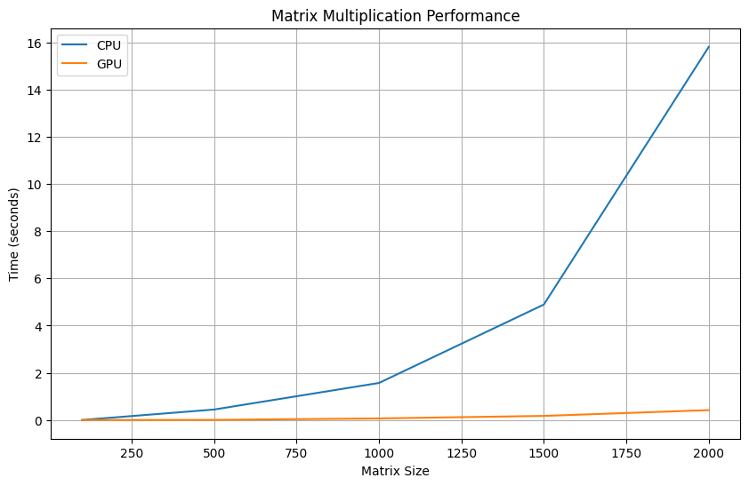

# **Лабораторная работа 1: Перемножение матриц**

*Задача:* реализовать алгоритм перемножения матриц на языке Python.

*Входные данные:* 2 матрицы размером от 100х100 до 2000х2000 каждая.

*Выходные данные:* проверка корректности перемножения + время вычисления.

Реализация должна содержать 2 функции перемножения матриц: на CPU и на GPU с применением CUDA.

## **Описание работы:**

- Google Colab использует видеокарту Nvidia Tesla T4.

- Функция *test_mat_mul_cpu* предназначена для тестирования и измерения времени выполнения умножения двух матриц с использованием CPU.

- Функция *test_mat_mul_gpu* предназначена для тестирования и измерения времени выполнения умножения двух матриц с использованием GPU. Распараллеливание достигается за счет того, что каждый поток на GPU обрабатывает один элемент результирующей матрицы. 

## **Результаты работы:**

### Таблица с результатами

| Matrix size| CPU time| GPU time |
|:--------:|:--------:|:--------:|
| 100 | 0.001307 | 0.000406 |
| 500 | 0.443843 | 0.006769 |
| 1000 | 1.569118 | 0.067391 |
| 1500 | 4.891590 | 0.174454 |
| 2000 | 15.807101 | 0.419402 |

### График производительности матричного умножения

**Вывод:** Проведенные тесты демонстрируют значительное преимущество использования GPU для умножения матриц по сравнению с CPU, особенно при увеличении размера матриц.