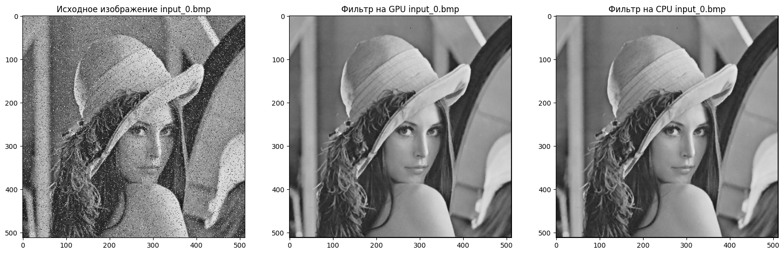
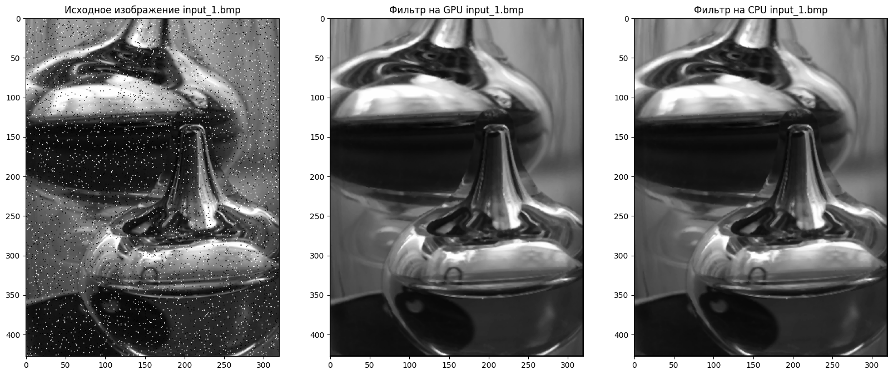
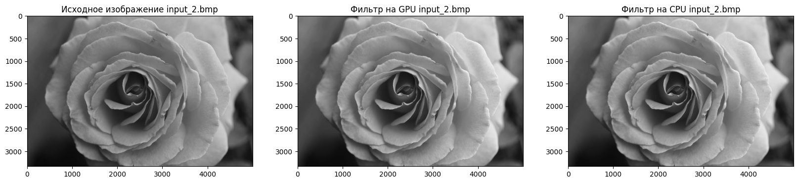
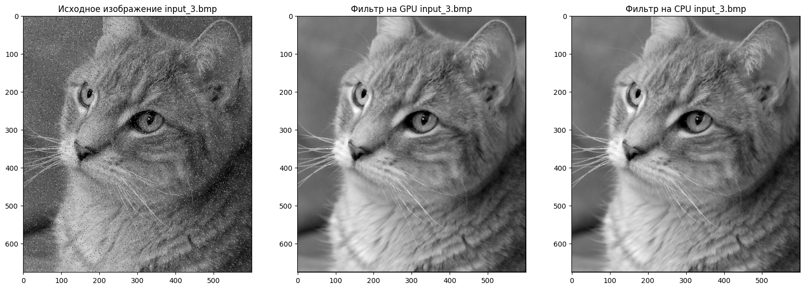
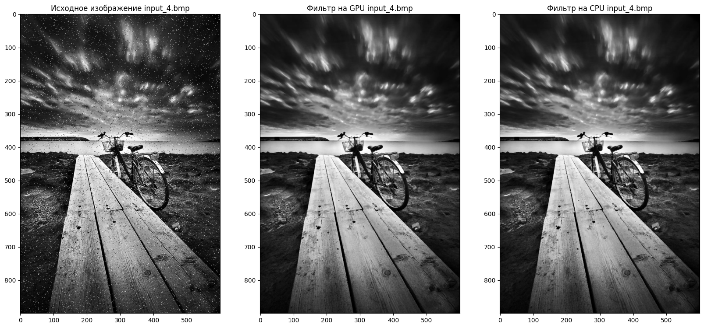

# **Лабораторная работа 3: Соль и перец**

*Задача:* реализовать алгоритм медианного фильтра для удаления шума "соль и перец" с изображения на языке Python.

*Входные данные:* изображение в формате BMP с шумом.

*Выходные данные:* 

- время выполнения обработки изображения на CPU;

- время выполнения обработки изображения на GPU;

- результирующее изображение после применения медианного фильтра на CPU;

- результирующее изображение после применения медианного фильтра на GPU.

Реализация должна содержать 2 функции медианного фильтра: на CPU и на GPU с применением CUDA.

## **Описание работы:**

- Google Colab использует видеокарту Nvidia Tesla T4.

- Функция *median_filter_kernel* выполняет медианную фильтрацию на GPU, где каждый поток обрабатывает один пиксель изображения, собирая значения соседних пикселей в локальный массив и вычисляя медиану.

- Функция *median_filter_gpu* управляет передачей данных между CPU и GPU, настраивает параметры сетки и блоков для параллельного выполнения и измеряет время работы фильтра.

- Функция *median_filter_cpu* применяет медианную фильтрацию к изображению на CPU. Она обрабатывает каждый пиксель, извлекая 3x3 окно соседей и вычисляя медиану, возвращая отфильтрованное изображение и время выполнения.

## **Результаты работы:**

### Таблица с результатами

- Среднее время выполнения на GPU: 0.0043 сек

- Среднее время выполнения на CPU: 58.2747 сек

- Среднее ускорение: 6257.2737

### Визуализация результатов

**Вывод:** Оба метода (GPU и CPU) успешно справились с задачей удаления шумов, однако использование GPU позволяет достичь существенного ускорения по сравнению с CPU. Это объясняется способностью GPU эффективно распараллеливать задачи, что особенно важно для обработки больших объемов данных, таких как изображения. В данном случае, GPU позволил ускорить выполнение задачи на несколько порядков, что является очень впечатляющим результатом. 