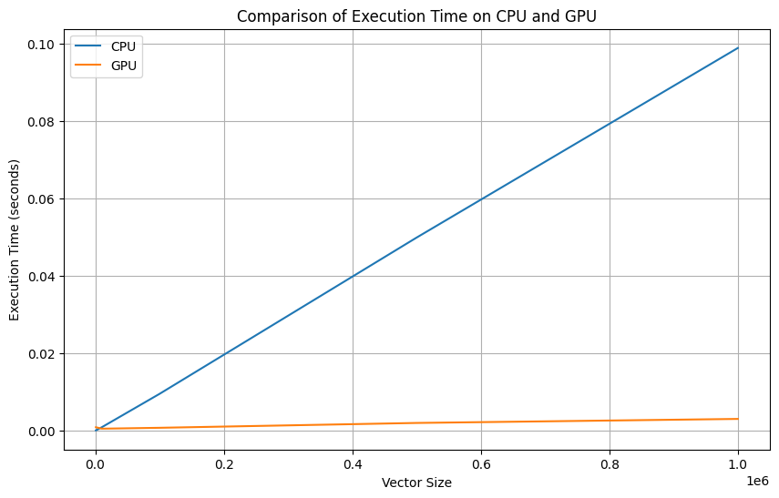

# **Лабораторная работа 2: Сумма элементов вектора**

*Задача:* реализовать алгоритм сложения элементов вектора на языке Python.

*Входные данные:* вектор размером 1 000 ... 1 000 000 значений.

*Выходные данные:* сумма элементов вектора + время вычисления.

Реализация должна содержать 2 функции сложения элементов вектора: на CPU и на
GPU с применением CUDA.

## **Описание работы:**

- Google Colab использует видеокарту Nvidia Tesla T4.

- Функция *sum_cpu* предназначена для последовательного суммирования элементов вектора на CPU.

- Функция *sum_kernel* предназначена для параллельного суммирования элементов вектора на GPU с использованием CUDA, осуществляя поэтапное суммирование внутри блоков с помощью общей памяти (shared memory).

- Функция *sum_gpu* распараллеливает суммирование, разделяя вектор на блоки, каждый из которых обрабатывается потоками на GPU, где выполняется загрузка данных в общую память, синхронизация потоков, редукция частичных сумм, и итоговые результаты объединяются на CPU.

## **Результаты работы:**

### Таблица с результатами

|   Vector size |    CPU sum |    CPU time |    GPU sum |    GPU time |   Speedup |
|--------------:|-----------:|------------:|-----------:|------------:|----------:|
|      1000     |    499.489 | 0.000152445 |    499.489 | 0.000961399 |  0.158566 |
|     10000     |   4980.63  | 0.000949097 |   4980.63  | 0.000589752 |  1.60931  |
|    100000     |  50004     | 0.00957384  |  50004     | 0.000820351 | 11.6704   |
|    500000     | 250096     | 0.0499047   | 250096     | 0.00207086  | 24.0986   |
|         1e+06 | 499844     | 0.0988453   | 499844     | 0.00310888  | 31.7945   |

### График производительности 

## Вывод:
Эксперименты показали, что время выполнения суммирования на GPU значительно меньше, чем на CPU, особенно при увеличении размера вектора, что подтверждает высокую эффективность распараллеливания. Ускорение достигает 31.79 раз при размере вектора 1e+06, что делает использование GPU предпочтительным для обработки больших объемов данных.